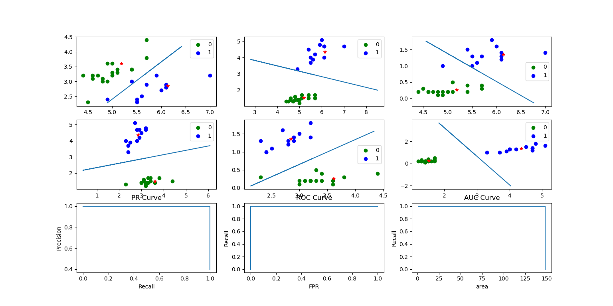

《机器学习》上机实践（1）

 

实验题：（本题使用MATLAB或Python完成均可）实验题：（本题使用MATLAB或Python完成均可，如果使用其他平台，数据集需要去这里下载https://archive.ics.uci.edu/ml/datasets/Iris）

 

注：本题包括公式推导需要给出推导过程，相关核心代码部分需自己完成，禁止调用库函数，否则没有成绩，边缘部分，例如可视化等，可以使用库函数实现。

 

Iris数据集（鸢尾花数据集）是常用的分类实验数据集，由Fisher于1936收集整理。数据集包含150个数据样本，分为3类，每类50个数据，每个数据包含4个属性。4个属性分别为花萼长度，花萼宽度，花瓣长度，花瓣宽度，单位是cm。3个类别分别为Setosa（山鸢尾），Versicolour（杂色鸢尾），Virginica（维吉尼亚鸢尾）。

 

\1. Iris数据集已与常见的机器学习工具集成，请查阅资料找出MATLAB平台或Python平台加载内置Iris数据集方法，并简要描述该数据集结构。

> {'data': array([[5.1, 3.5, 1.4, 0.2],
>     [4.9, 3. , 1.4, 0.2],
>     [4.7, 3.2, 1.3, 0.2]，
>     ···
> 'target': array([0, 0, 0, 0, ···
> 'frame': None, 
> 'target_names' ···}
>
> 数据集是一个map，其中data中含有150个数据，每个数据有四个属性值；target中为data中数据对应的分类，有0-2共三种；target_names中为分类值所对应的花名

\2. Iris数据集中有一个种类与另外两个类是线性可分的，其余两个类是线性不可分的。请你通过数据可视化的方法找出该线性可分类并给出判断依据。

```python
from sklearn import datasets
import matplotlib.pyplot as plt
import pandas as pd


#加载数据集，是一个字典类似Java中的map
Iris = datasets.load_iris()
#print(Iris)


#数据集预处理
Iris_df = pd.DataFrame(Iris.data)
Iris_df.insert(0,'target',Iris.target)
#按目标分类
Iris_div = []
for i in range(0,3):
    Iris_div.append(Iris_df[Iris_df['target']==i])

#颜色表
colmaps = ['red', 'green', 'blue']

for i in range(0,3):
    for j in range(0,3):
        for k in range(0,3):
            #挑选出ij两个维度作为x轴和y轴，k作为目标种类
            x_axis = Iris_div[k][i]
            y_axis = Iris_div[k][j]
            #画ij子图的第k种颜色
            plt.subplot(3,3,3*i+j+1)
            plt.scatter(x_axis, y_axis, c=colmaps[k], label=k)
            #添加图例
            plt.legend()

plt.show()
```


> 
>
> 0是线性可分的，可以通过一个线性函数将其与另外两个类分开


\3.去除Iris数据集中线性不可分的类中最后一个，余下的两个线性可分的类构成的数据集命令为Iris_linear，请使用留出法将Iris_linear数据集按7:3分为训练集与测试集，并使用训练集训练一个MED分类器，在测试集上测试训练好的分类器的性能，给出《模式识别与机器学习-评估方法与性能指标》中所有量化指标并可视化分类结果。

```python
from sklearn import datasets
from sklearn import metrics
import matplotlib.pyplot as plt
import pandas as pd
import numpy as np
import math


class MED(object):
    #初始化
    def __init__(self):
        self.vlen = 0 
        self.cnt = 0 #统计向量个数
        self.center_coordinates = {} #计算向量之和并最后求均值
        self.score = []

    #向量距离
    def __distance(self, x, y):
        #print(x)
        #print(y)
        tot = 0
        for i in range(0,self.vlen):
            tot += (x[i]-y[i])*(x[i]-y[i])
        return math.sqrt(tot)

    #留出法
    def div(self, data):
        #生成训练集
        Iris_linear_train = pd.DataFrame(Iris_linear.iloc[0:int(len(Iris_linear)*0.7)])
        #print(Iris_linear_train)
        X_train = Iris_linear_train[[0, 1, 2]]
        Y_train = Iris_linear_train['target']
        #print(X_train)
        #print(Y_train)

        #生成测试集
        Iris_linear_test = Iris_linear.iloc[int(len(Iris_linear)*0.7):len(Iris_linear)].reset_index(drop=True)
        #print(Iris_linear_test)
        X_test = Iris_linear_test[[0, 1, 2]]
        Y_test = Iris_linear_test['target']
        #print(X_test)
        #print(Y_test)
        return X_train , Y_train , X_test , Y_test

    #训练
    def fit(self, X_train, Y_train):
        self.vlen = len(X_train.columns)
        self.cnt = len(X_train.index)
        #计算向量之和
        for i in X_train.index:
            x = X_train.iloc[i]
            y = Y_train.iloc[i]
            if y not in self.center_coordinates.keys():
                self.center_coordinates[y]=x
            else:
                self.center_coordinates[y]=self.center_coordinates[y].add(x,fill_value=0)
        #计算均值
        for i in self.center_coordinates:
            self.center_coordinates[i]=self.center_coordinates[i]/self.cnt
    
    #打分
    def __score(self, X_test):
        self.Y_score = []
        for i in X_test.index:
            x = X_test.iloc[i]
            total = 0
            for j in self.center_coordinates:
                total += 1/self.__distance(x, self.center_coordinates[j])
            score = 1/self.__distance(x, self.center_coordinates[1]) / total
            self.Y_score.append(score)
        return self.Y_score

    #评估
    def evaluate(self, X_test, Y_test):
        Y_score = self.__score(X_test)
    
        # PR
        y_true = np.array(Y_test)
        y_scores = np.array(Y_score)
        precision, recall, thresholds = metrics.precision_recall_curve(y_true, y_scores)

        plt.title('Precision/Recall Curve')# give plot a title
        plt.xlabel('Recall')# make axis labels
        plt.ylabel('Precision')
        plt.plot(recall,precision)
        plt.show()

        Precision = metrics.average_precision_score(Y_test, self.Y_score)
        print("Precision: %f" % Precision)
    
if __name__ == '__main__':
    #加载数据集，是一个字典类似Java中的map
    Iris = datasets.load_iris()
    #数据集预处理
    Iris_df = pd.DataFrame(Iris.data)
    Iris_df.insert(0,'target',Iris.target)

    #构造新数据集
    Iris_linear = Iris_df[Iris_df['target']!=2]#删除2类
    Iris_linear = Iris_linear.sample(frac=1).reset_index(drop=True)#随机打乱
    #print(Iris_linear)

    med = MED()
    X_train  , Y_train, X_test , Y_test = med.div(Iris_linear)
    med.fit(X_train, Y_train)
    med.evaluate(X_test, Y_test)
```
> 

\4. 将Iris数据集白化，可视化白化结果并于原始可视化结果比较，讨论白化的作用。

> 1，减少特征之间的相关性；
>
> 2，使特征具有相同的方差（协方差阵为1）

\5. 去除Iris数据集中线性可分的类，余下的两个线性不可分的类构成的数据集命令为Iris_nonlinear，请使用留出法将Iris_nonlinear数据集按7:3分为训练集与测试集，并使用训练集训练一个MED分类器，在测试集上测试训练好的分类器的性能，给出《模式识别与机器学习-评估方法与性能指标》中所有量化指标并可视化分类结果。讨论本题结果与3题结果的差异。

 

\6. 请使用5折交叉验证为Iris数据集训练一个多分类的贝叶斯分类器。给出平均Accuracy，并可视化实验结果。与第3题和第5题结果做比较，讨论贝叶斯分类器的优劣。

 